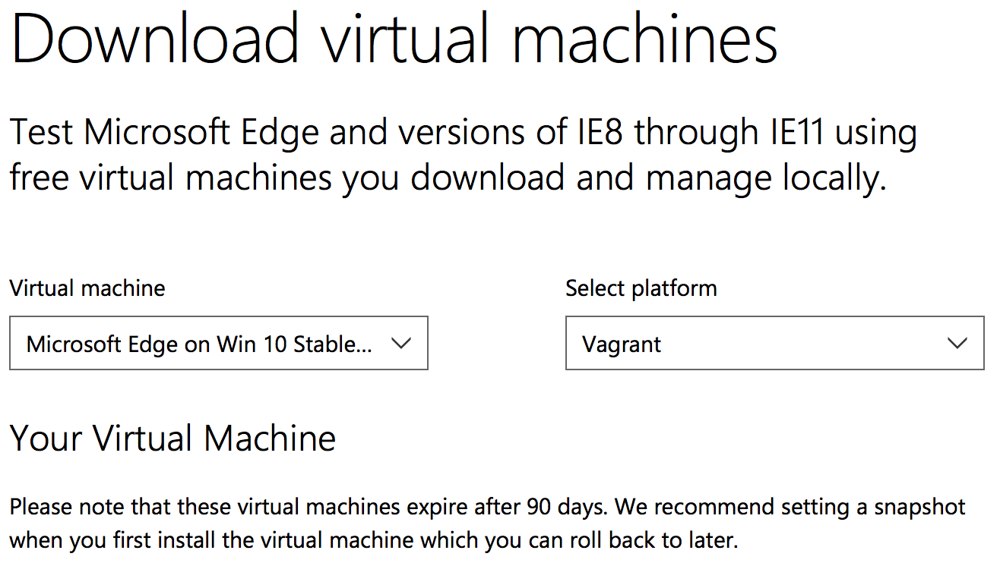

# Deep Dive: Vagrant
### 2016 Q3 EMC Accreditation
### Jonas Rosland (@jonasrosland) &
### Matt Cowger (@mcowger)


---

# Recap: Vagrant

Create and configure lightweight, reproducible, and portable development environments.

Boot up entire configured systems in minutes.

Run them anywhere!

---

# Basic Vagrantfile

```
Vagrant.configure("2") do |config|
  config.vm.box = "hashicorp/precise64"
end
```

---

# Vagrant boxes

Many to choose from, have a look at http://vagrantbox.es
 - CentOS
 - SLES
 - Debian/Ubuntu
 - FreeBSD
 - Arch
 - Windows!

---

# Windows on Vagrant

Officially supported images can be found at
https://developer.microsoft.com/en-us/microsoft-edge/tools/vms/



---

# Create a new Vagrant environment

Add a new Vagrant box

```
  vagrant box add win8.1 http://aka.ms/vagrant-win81-ie11
```

Initialize and run a new Vagrant environment

```
  vagrant init win8.1
```

```
  vagrant up
```

---

# Demo!

---

# Port forwarding

Forward localhost:8080 to vm:80, so we can access services

```
  config.vm.network "forwarded_port", guest: 80, host: 8080
```
---

# Install and configure apps/services

There are multiple ways of installing apps and services in your Vagrant VMs

 - Scripts (bash, PowerShell)
 - Ansible
 - Puppet
 - Chef
 - And others

---

# Example of bash scripting

```
  config.vm.provision "shell",
    inline: "apt-get install wget -y"
```

---

# More advanced example

```
  master_ip = 10.47.1.15
  if hostname == "mesos-master"
    node.vm.provision "shell", inline: <<-SHELL
      echo #{master_ip} > /etc/mesos-master/advertise_ip
      service mesos-master restart
      apt-get install -y httpie
    SHELL
  end
```

---

# For more information

http://vagrantup.com
