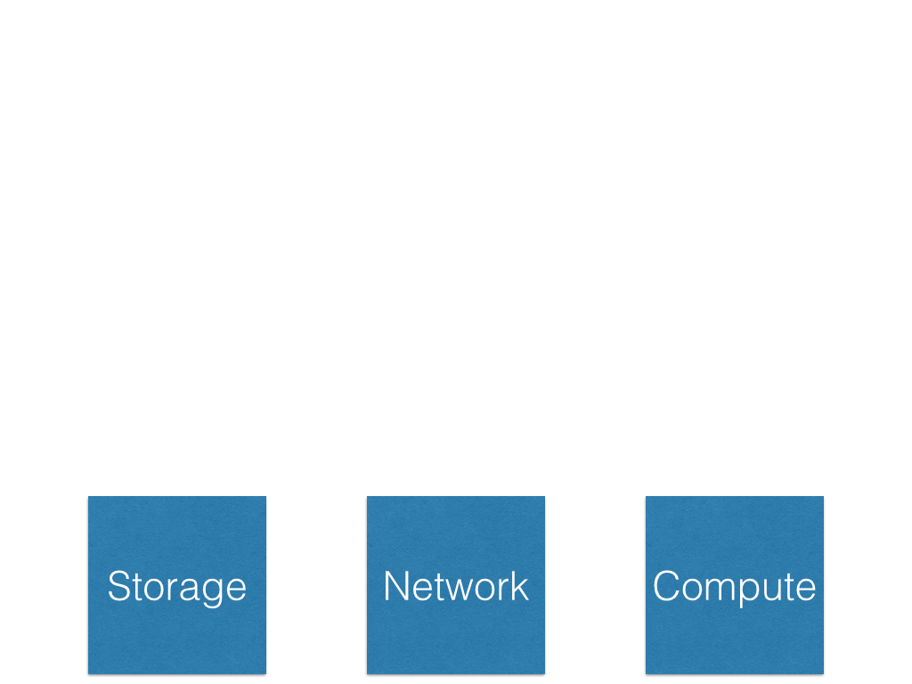
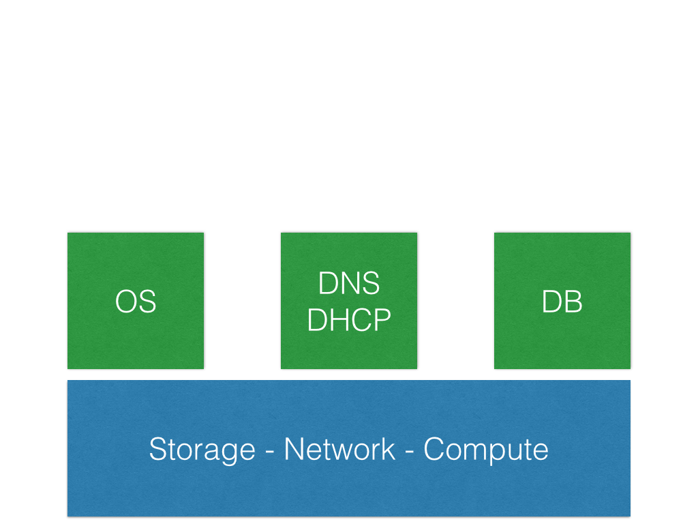
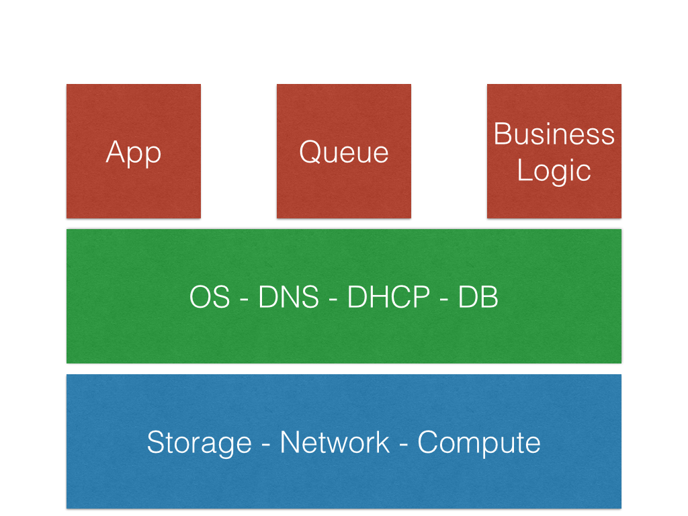

# Infrastructure As Code
## 2015 Q2 EMC Accreditation
## Jonas Rosland & Matt Cowger

---

# What do we define as infrastructure?

---



^ storage network compute
^ what we normally sell

---



^ support services

---



^ app code, queueing, databases, etc

---

# Why define infrastructure as code?

 - Deploy, monitor and connect together all the pieces needed to run services for the organization
 - Processes and tools for faster end-to-end delivery of quality services
 - Automation comes built-in

---

# How do we do this?

 - Desired state specified in text files
 - Autonomic (self-corrects to desired state)
 - State should be known through monitoring
 - Remove snowflake servers

---

# Why store them in text files?

 - Easy to read and edit
 - Shareable
 - Can use standard version control like Git or SVN
 - Becomes executable documentation

---

# Simple example

```
node 'www2' {
  class { 'apache': }             # use apache module
  apache::vhost { 'awesomewebsite.com':  # define vhost resource
    port    => '80',
    docroot => '/var/www/html'
  }
}
```

---

# Change root password

```
user { root:
  ensure   => present,
  password => '$ecretP@ssw0rd',
}
```

---


---


---

> Manually configured environments are like a house of cards in a china shop
-- Neal Ford

---

# Snowflake servers

Deploying, provisioning and scaling automatically is virtually impossible if every server is unique

Adds friction between the requestor and the deployer

Mistakes happen

We're all human

---

# What can happen if you don't treat infrastructure as code?

---

# Some firms have found that up to 60% of failures are caused by human error, not hardware failure

---

# Example - Knight Capital Group


---

# Knight Capital Group - What happened?

Manual deployment of new trading software

7 of 8 servers correctly updated

## Old function still alive on the 8th server led to
# $440 million loss in 45 minutes

---

# **Treat your infrastructure as code**

---

# Benefits

Self documenting infrastructure

You now have source code for how anything in your datacenter is setup

**Executable documentation**

---

Further reading:

[PuppetLabs](http://puppetlabs.com)

[Vagrant](http://vagrantup.com)

[Docker](http://docker.com)

[Infrastructure as Code: A reason to smile](http://www.thoughtworks.com/insights/blog/infrastructure-code-reason-smile)
