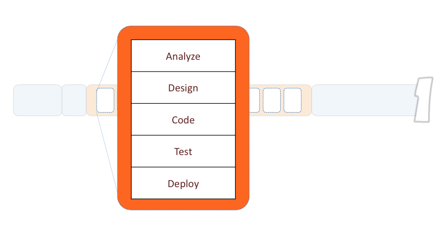

# Agile 101

> - You can't gather all the requirements up front
- The requirements you do gather **will** change
- The is always more to do than time and money will allow

-- The Agile Samurai, J. Rasmusson

---

> 21% of software projects are considered "failed", 42% "challenged"

--2010 study

---

#Why Agile?

* Too many projects not delivered
* Software taking too long to get to market
* Requirements not met
* High costs to make changes after delivery
* Having to “get it right” first time/up front
*  Too many defects
* Unhappy Customers
* Unhappy Developers

---

# Software Development Methodologies
* Code-fix” (or no process)
* Structured, heavy weight methodologies a.k.a.
“Plan Driven Methodologies” and “Waterfall”
* Largely influenced by _traditional engineering_ and quality processes in industries
* Desire to make software development more _predictable, measurable_ and efficient
* Strong emphas is on _detailed planning_ and then_ executing to the plan_

---

# But Software is Different

* Is not Tangible
* Is not based on Mathematics
* Needs Knowledge Workers

---

# Relevance

###Heavy weight methodologies are most successful when:
* Requirements are stable
* Technology is well known and mature
* Everything happens as one would expect
* We are not taking on anything new or unknown
* Coding is ‘copy and paste’

---

>Today, projects with these characteristics are few and far between

---

>Heavy weight methodologies work in some instances, but there are high costs, and the risk in using them in dynamic environments is high

---

# Origins Of Agile

###Agile Methods are a reaction to:
* Rigidity of heavy weight methods
* Bureaucracy introduced by heavy weight
methods
* Unpleasant Surprises due to lack of visibility
* The myth that a well defined process is more valuable than the people who use it

---

# Agile Follows Systems Thinking
* System Thinking is a way of looking how things influence each other as a whole and not as individual parts
* Focus on Flow, not Function
* Look at the end-to-end process and the value we
deliver our customers
  * What do our customers value
  * How do we respond to the demands from our customers, as a system

---

# Influences On Agile (contd.) Agile Follows Lean Thinking
* Add nothing but value (eliminate waste)
* Flow value from demand (delay commitment)
* Minimize inventory (minimize intermediate artifacts)
* Optimize across the organization

---

# The Agile Manifesto

>We are uncovering better ways of developing software by doing it and helping others do it. Through this work we have come to value:

* Individuals and interactions over processes and tools
* Working software over comprehensive documentation
* Customer collaboration over contract negotiation
* Responding to change over following a plan.

>That is, while there is value in the items on the right, we value the items on the left more.”

---

#12 Principles of Agile

* Our highest priority is to satisfy the customer through early
and continuous delivery of valuable software.
* Welcome changing requirements, even late in
development.

---

* Deliver working software frequently, with a preference to the shorter timescale.
* Business people and developers must work together throughout the project.
* Build projects around motivated

---

*  individuals. Give them the environment and support they need, and trust them to get the job done.
* The most efficient and effective method of conveying information is face-to-face conversation.

---

* Working software is the primary measure of progress.
* Agile processes promote sustainable development. The sponsors, developers, and users should be able to maintain a constant pace indefinitely.

---

* Continuous attention to technical excellence and good design enhances agility.
* Simplicity--the art of maximizing the amount of work not done--is essential.

---

* The best architectures, requirements, and designs emerge from self-organizing teams.
* At regular intervals, the team reflects on how to become more effective, then tunes and adjusts its behaviour accordingly.

#Agile Project Lifecycle
## Timeboxed iterations

---

#The Basics

---

#Lifecycle

---

#Iterative

---

#Incremental

---

#Agile Myths

Agile Myths
* No Planning
* No Documentation
* Lacks Discipline
* Limited to Co-Located Teams
* Open Ended

---

#Agile Roles

* Product Owner
* Scrum Master
* Pigs (Team Members)
