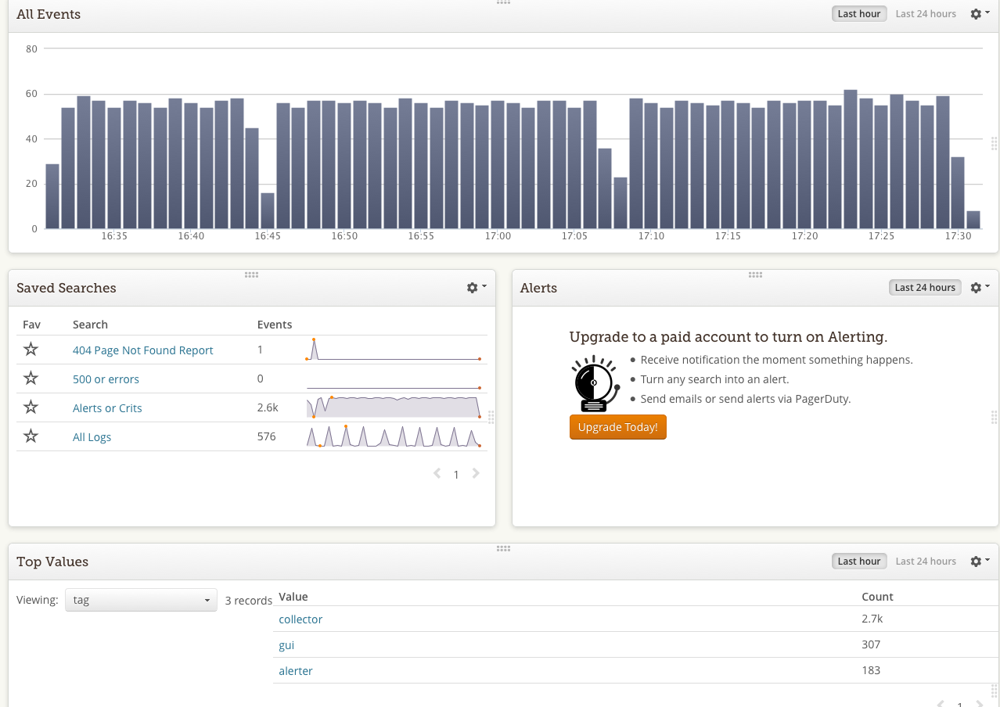

#DevOps Agile Geek Week

>XI. Logs
Treat logs as event streams

-- The 12 Factor App

^ Open this presentation with [Deckset](http://www.decksetapp.com/)

---

##Microservices Drive Requirements

* 10s or even 100s of microservices means a huge number of logs to comb through for an event
* performance analytics become critical when you have thousands of users and interdependent services

---

# Logging

* log everything
* no really, everything
* `chargers.cfapps.io` logs ~73 MB/day

---

# Logging Rules

* app never concerns itself with routing or storage of its output stream
* usually write to `stdout`
* include deep information as to file, module, function, lineno
* include a correlation id with every message
* log in UTC
* log with appropriate level: `debug` vs. `info` vs. `critical`

---

# Logging Tools

* use language-native tools for logging
  * python `logging`
  * node `winston` or `bunyan`
  * ruby `yell` or `logging`
* configurable tools are better tools
* multiple output streams are better
* multiple logging levels are better

---

# Log Management Tools

* splunk (http://www.splunk.com)
* loggly (http://www.loggly.com)
* logstash (https://github.com/elasticsearch/logstash)
  * "ELK" stack - elasticsearch, logstash, kibana
* graylog2
* many others

---

# Logging Tips
* send all logs to `stdout` **and** logging system
* set alerts on messages of give `type` per `minute|hour|whatever`
* use correlation id to track a given transaction/request

---

#gah, enough text!  what's it look like?

---

